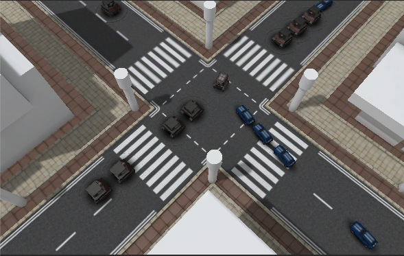

#readme

##以下のアセットを要求します。

[Minicar FREE - Low Poly / Mobile Ready](https://www.assetstore.unity3d.com/#/content/7321
)  
[Mobile Tanks Pack](https://www.assetstore.unity3d.com/#/content/13148)  
[Simple Modular Street Kit](https://www.assetstore.unity3d.com/#/content/13811)  

##導入手順

1.  上記のアセットを全て導入
2.  **Streets**>**CrossX.FBX**の**Generate Lightmap UVs**にチェックを入れる
3.  **Streets**>**Street1Lane30m.FBX**の**Generate Lightmap UVs**にチェックを入れる